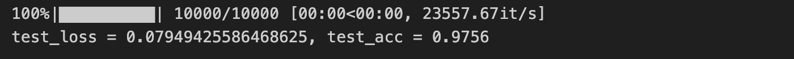

<script type="text/javascript" src="http://cdn.mathjax.org/mathjax/latest/MathJax.js?config=TeX-AMS-MML_HTMLorMML"></script>
<script type="text/x-mathjax-config"> MathJax.Hub.Config({ tex2jax: {inlineMath: [['$', '$']]}, messageStyle: "none" });</script>

# Lab 1 - Understand Neural Network and Training Process

## Implementation

在這個 lab 中我選擇仿照 PyTorch 來實作，首先定義 `Parameter` 和 `Module` 兩個類別，`Parameter` 用來儲存 layer 中的參數及其梯度，`Module` 則是用來定義神經網路中的 operator，為一個 base class，任何的 layer 都需要繼承自 `Module`，並實作 `forward` method。

```python
class Parameter:
    def __init__(self, data: np.ndarray) -> None:
        self.data = data
        self.grad = None


class Module:
    def __call__(self, *args, **kwargs) -> np.ndarray:
        return self.forward(*args, **kwargs)

    def __repr__(self) -> str:
        layers = '\n'.join([f'  ({k}): {v}' for k, v in self.__dict__.items()])
        return f'{self.__class__.__name__}(\n{layers}\n)'
```

`Linear` layer 有兩個參數 weight `W` 和 bias `b`，其尺寸分別為 `(in_features, out_fetures)` 和 `(1, out_features)`，其中 `in_features` 和 `out_features` 由使用者於呼叫 constructor 時提供，`W` 的初始值是隨機產生，`b` 的初始值則全設為 `0`。

在 forward propagation 中計算 $y = x \times W + b$ 作為輸出回傳；backward propagation 則是以 $\frac{\partial L}{\partial y}$ 為輸入分別計算 weight 的 gradient $\frac{\partial L}{\partial W} = x \times \frac{\partial L}{\partial y}$ 和 bias 的 gradient $\frac{\partial L}{\partial b} = \frac{\partial L}{\partial y} \times 1$，最後將 $\frac{\partial L}{\partial x}$ 回傳作為上一個 layer 的 backward propagation input。

```python
class Linear(Module):
    def __init__(self, in_features, out_features) -> None:
        super().__init__()
        self.in_features = in_features
        self.out_features = out_features

        # Initialize weights and biases
        init_factor = 0.01
        self.W = Parameter(np.random.randn(in_features, out_features) * init_factor)
        self.b = Parameter(np.zeros((1, out_features)))

        # Cache for backward pass
        self.x = None

    def forward(self, x):
        self.x = x  # cache input for backward pass
        return np.dot(x, self.W.data) + self.b.data

    def backward(self, dy):
        self.W.grad = np.dot(self.x.T, dy)
        self.b.grad = np.sum(dy, axis=0, keepdims=True)  # sum over batch dimension
        dx = np.dot(dy, self.W.data.T)
        return dx
```

`ReLU` 和 `Sigmoid` 為單純的 element-wise activation functions，沒有參數。 `ReLU` 不管是 forward 還是 backward 都是把矩陣中負的元素設為 0，正的元素維持原來的值回傳。

```python
class ReLU(Module):
    def __init__(self) -> None:
        super().__init__()
        self.x = None

    def forward(self, x):
        self.x = x
        return np.maximum(0, x)

    def backward(self, dy):
        dx = dy.copy()
        dx[self.x < 0] = 0
        return dx
```

`Sigmoid` 在 forward propagation 計算 $y = \frac{1}{1 + e^{-x}}$，backward propagation 則只要計算 input activation 的 gradient $\frac{\partial L}{\partial x} = \frac{\partial L}{\partial y} \times y \times (1 - y)$。

```python
class Sigmoid(Module):
    def __init__(self) -> None:
        super().__init__()
        self.y = None

    def forward(self, x):
        self.y = 1 / (1 + np.exp(-x))
        return self.y

    def backward(self, dy):
        dx = dy * self.y * (1 - self.y)
        return dx
```

`Softmax` 在 forward propagation 計算 $y = \frac{e^x}{\sum_i e^x_i}$，為了減少重複的計算，先把 $e^x$ 算出來後儲存在中間暫存的變數，再使用暫存的變數來計算總和和最終的 sigmoid output；backward propagation 直接回傳 $\frac{\partial L}{\partial y}$，原因是假設了 softmax 後緊接著使用 cross entropy loss，因此計算上得以簡化。

```python
class Softmax(Module):
    def __init__(self) -> None:
        super().__init__()
        self.y = None

    def forward(self, x):
        # subtract max for numerical stability
        ex = np.exp(x - np.max(x, axis=-1, keepdims=True))
        self.y = ex / np.sum(ex, axis=-1, keepdims=True)
        return self.y

    def backward(self, dy):
        # Assume dy is coming from a cross-entropy loss
        return dy
```

## Forward and Backward Propagation

模型的架構設計如下：

```python
class MLP(Module):
    def __init__(self) -> None:
        self.fc1 = Linear(784, 512)
        self.relu1 = ReLU()
        self.fc2 = Linear(512, 64)
        self.relu2 = ReLU()
        self.fc3 = Linear(64, 10)
        self.softmax = Softmax()

    def forward(self, x):
        x = self.fc1(x)
        x = self.relu1(x)
        x = self.fc2(x)
        x = self.relu2(x)
        x = self.fc3(x)
        x = self.softmax(x)
        return x

    def backward(self, dy):
        dy = self.softmax.backward(dy)
        dy = self.fc3.backward(dy)
        dy = self.relu2.backward(dy)
        dy = self.fc2.backward(dy)
        dy = self.relu1.backward(dy)
        dy = self.fc1.backward(dy)
        return dy
```

訓練的程式碼如下：

```python
def train_one_epoch(
    model: Module, trainldr: Iterable, criterion, optimizer
) -> tuple[float, float]:
    total = 0
    correct = 0
    total_loss = 0
    for x, y in tqdm(trainldr):
        # forward propagation
        y_pred = model.forward(x)

        # compute loss
        loss = criterion.forward(y_pred, y)
        total_loss += loss * len(y)

        # compute accuracy
        correct += y[0, np.argmax(y_pred)]
        total += len(y)

        # backward propagation
        grad = criterion.backward()
        model.backward(grad)

        # update parameters
        optimizer.step()
        optimizer.zero_grad()

    avg_loss = total_loss / total
    accuracy = correct / total
    return avg_loss, accuracy
```


在 forward propagation 的過程中，input `x` 傳入 `forward` method 後會依序經過 `fc1`、`relu1`、`fc2`、`relu2`、`fc3`、`softmax` 等 layers，做每一層相應的計算，然後輸出一個 size 為 `(1, 10)` 的 output，其中每個 element 代表輸入的圖片 `x` 被模型辨識為各個類別的機率。接著將 output 和 ground truth 傳入 `criterion` 計算 loss，這裡使用的是 cross entropy。

在 backward propagation 中，先呼叫 `criterion.backward()` 計算 cross entropy 和 softmax 的 gradient (兩者已經 fuse 在一起以簡化計算)，接著把 gradient $\frac{\partial L}{\partial y}$ 傳入模型的 `backward()` method 中，依序經過 `fc3`、`relu2`、`fc2`、`relu1`、`fc1` 的 `backward()`，若經過的是沒有參數的 activation layers，只需要計算 activation 的 gradient 並回傳，若經過有參數的 linear layers，則需要額外再計算各個參數的 gradient 並保存在該 layer 中，等待後續參數更新。

接著在 update parameters 時則是把所有註冊在 optimizer (這裡使用 SGD，stochastic gradient descent) 的參數做更新，實作細節如下，當呼叫 `step()` method 時，會把各個參數的 gradient $\frac{\partial L}{\partial \theta}$ 乘上 learning rate $\eta$ 作為變化量用來更新參數，也就是 $\theta^\text{new} = \theta^\text{old} - \eta \frac{\partial L}{\partial \theta}$。把模型中所有參數都更新了之後，再呼叫 `zero_grad()` method 把各層參數的 gradient 歸零以利下一個 epoch 的計算。

```python
class SGD:
    def __init__(self, params: Iterable, lr: float = 1e-3) -> None:
        self.params = params
        self.lr = lr

    def step(self):
        for param in self.params:
            if param.grad is not None:
                param.data -= self.lr * param.grad

    def zero_grad(self):
        for param in self.params:
            if param.grad is not None:
                param.grad.fill(0)
```

## Restuls

以下是 training 的過程，我把 training set 中 60000 張圖片中 90% 也就是 54000 張圖片用來做 training，剩下的 10% 也就是 6000 張圖片用來做 validation，使用 SGD optimizer 訓練 10 個 epochs，learining rate 設為 0.0001，可以看到從 epoch 1 開始 training accuracy 和 validation accuracy 就都超過了 90%，持續訓練至 epoch 9 的過程中 loss 皆持續下降、accuracy 持續上升，代表沒有發生 overfitting 的狀況


使用 test set 中的 10000 張圖片做測試，達到 97.56% 的準確度。


