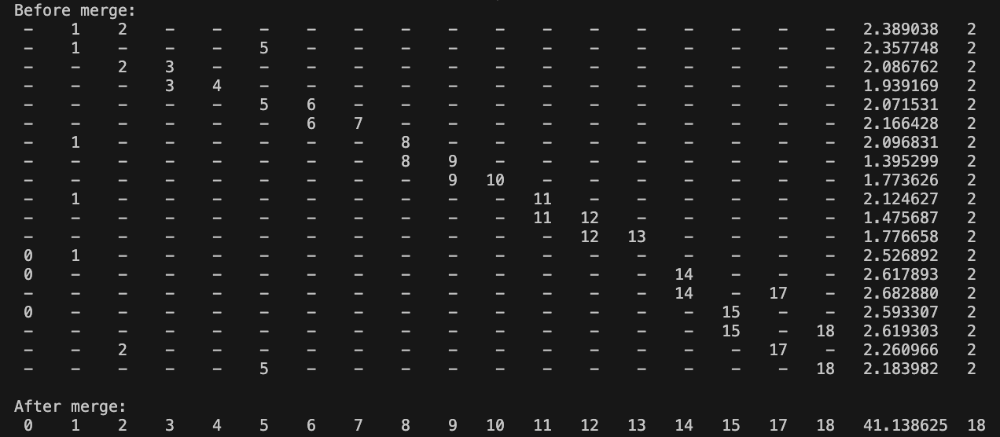
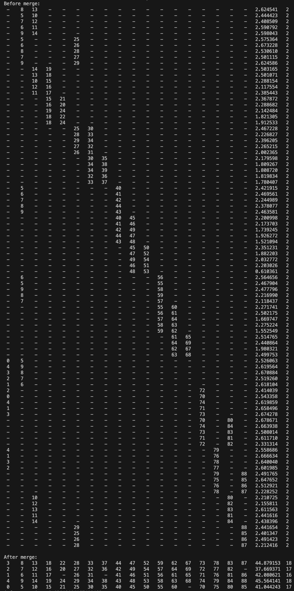
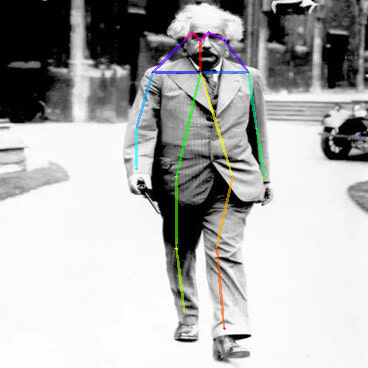
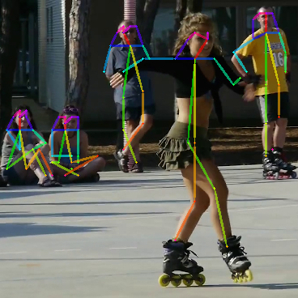
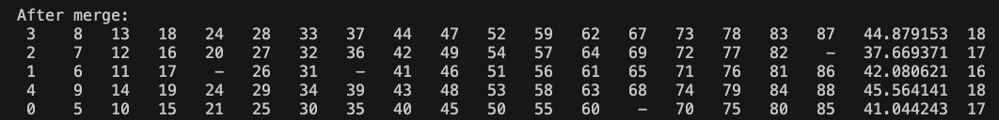
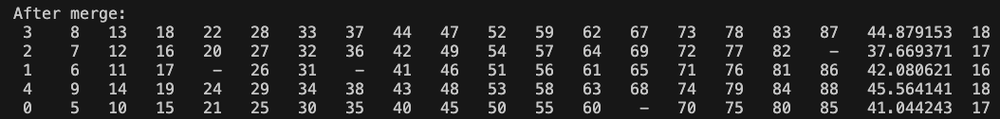

# Lab 3 - Human Pose Estimation

## Algorithm

`subset` 中有多個 `list`，每個 `list` 表示一個肢段，下面程式碼使用兩層 `for` 迴圈，檢查任兩相異肢段 `i` 和 `j` 是否含有相同的身體部位 `k`，若有，則將兩個 `list` 代表的肢段取聯集合併。

```python
for i in range(len(subset)):
    for j in range(len(subset)):
        if i == j:
            continue
        for k in range(18):
            if subset[i][k] == subset[j][k] and subset[i][k] != -1:
                _merge(subset, i, j)
                break
```

合併任兩相異肢段 `i` 和 `j` 的程式碼如下，若肢段 `i` 有缺少的部位，直接拿肢段 `j` 的部位來補，同時將該部位從肢段 `j` 中移除 (設為 `-1`)，對 18 個部位都完成合併後，兩肢段的調整分數和部位數量。

```python
def _merge(subset, i, j):
    # merge subset j into subset i
    for k in range(18):
        if subset[i][k] == -1:
            subset[i][k] = subset[j][k]
        subset[j][k] = -1

    # sum the score
    subset[i][-2] += subset[j][-2]
    subset[j][-2] = 0

    # sum the parts_num
    subset[i][-1] = sum(1 for k in subset[i][:-2] if k != -1)
    subset[j][-1] = 0
```

## Output Subset

### Single-Person HPE

第一張圖片 (單人) 的輸出如下，合併前缺少的肢段用 `-` 符號表示，最後輸出一個人體，具有 18 個肢段。



### Multi-People HPE

第二張圖片 (多人) 的輸出如下，合併前後缺少的肢段用 `-` 符號表示，最後輸出五個人體。

值得注意的是，在合併前的輸入中，第 18、19 個 `list` (index 從 0 開始數) 有出現衝突，兩者右手肘的 ID 皆為 `18`，但右手腕分別為 `22` 和 `24`，顯然不合理，這裡我採用的處理方式是以先進行連接的部位為主，若該部位已經被連接過，即便其他肢段有連接還是選擇忽略。



### Test Images

### Single-Person HPE



### Multi-People HPE



## Challenges and Solutions

起初我沒有注意到 `subset` 中的肢段可能發生衝突，因此實作 helper function `_merge` 如下：

```python
def _merge(subset, i, j):
    # merge subset j into subset i
    for k in range(18):
        if subset[j][k] != -1:
            subset[i][k] = subset[j][k]
            subset[j][k] = -1

    # ... skip below ...
```

判斷肢段 `j` 若有尚未合併的部位，則將其合併至肢段 `i` 中，並將該部位自肢段 `j` 移除。

然而，第二張測試圖片中的第 18、19 個 `list` (index 從 0 開始數) 有出現衝突，兩者右手肘的 ID 皆為 `18`，但右手腕分別為 `22` 和 `24`，在這樣的演算法下會部位 `22` 會在後面被部位 `24` 覆蓋掉，以致於最終輸出如下，有兩個人共享右手腕 `24`。



因此修正 `_merge` 如下：

```python
def _merge(subset, i, j):
    # merge subset j into subset i
    for k in range(18):
        if subset[i][k] == -1:
            subset[i][k] = subset[j][k]
        subset[j][k] = -1

    # ... skip below ...
```

修正後就得到正確答案


