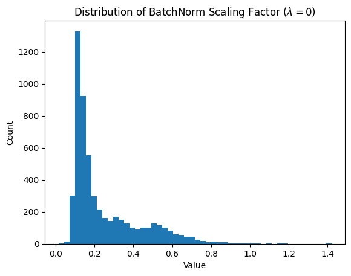

# Lab 4 - Model Pruning

## Sparsity Training Accuracy over Epochs

## Sparsity Regularization

### Scaling Factor Distribution of $\lambda = 0$

### Scaling Factor Distribution of $\lambda = 10^{-5}$

### Scaling Factor Distribution of $\lambda = 10^{-4}$

## Test Accuracy with Prune Ratio 50%

Take $\lambda = 10^{-4}$ for example

## Test Accuracy with Prune Ratio 90%

Take $\lambda = 10^{-4}$ for example

## Fine Tuning Accuracy over Epochs

Take $\lambda = 10^{-4}$ and prune ratio 90% for example

## Problem Encountered and Solution

這次 lab 最大的挑戰在於理論與實作的落差，雖然我大致理解助教在影片中講解的 pruning 概念，但在實際動手時卻卡住了，助教雖然提供了程式碼註解，但這些註解過於細碎，往往只解釋單行程式碼的作用，卻無法串連起整體運行的邏輯，讓我對應到理論的部分感到困難。

最後，我參考了《Learning Efficient Convolutional Networks through Network Slimming》這篇論文作者公開的程式碼實作 ([1], [2])，才逐漸釐清這次 lab 的實作細節並完成了這個 lab 的作業。

[1] [liuzhuang13/slimming: Learning Efficient Convolutional Networks through Network Slimming, In ICCV 2017.](https://github.com/liuzhuang13/slimming?tab=readme-ov-file)

[2] [Eric-mingjie/network-slimming: Network Slimming (Pytorch) (ICCV 2017)](https://github.com/Eric-mingjie/network-slimming)
