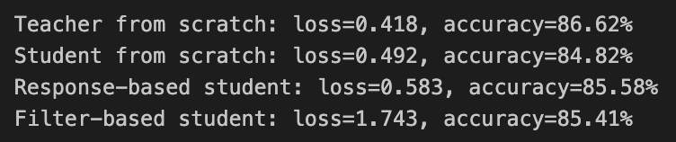
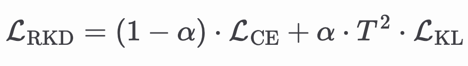
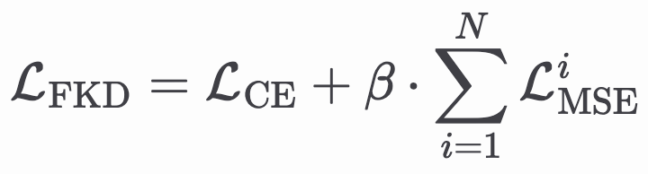

# Lab 5 - Knowledge Distillation

## Results

以下四個模型皆使用 learning rate 0.001 訓練 20 epochs，其中使用 response-based distillation 和 feature-based distillation 方法訓練 ResNet-18 (student model) 得到的 accuracy 分別為 85.58 % 和 85.41 %，兩者皆優於 train from scratch 的 84.82 %

<center></center>

## Hyperparameter Tuning for Response-based KD

- 先設定 $\alpha = 0.1$、$T = 1$，以固定的 learning rate 0.001 訓練模型 20 epochs
- 接著固定 $\alpha = 0.1$，從 $T \in \{2, 3, ..., 10\}$ 中嘗試不同的 $T$ 值以同樣的 learning rate、optimization algorithm 訓練同樣多個 epochs
- 選取最佳的 $T$ 值固定，調整 $\alpha \in \{0.1, 0.2, ..., 1\}$
- 最後得到最佳的 $\alpha = 0.5$ 和 $T = 4$

## Implementation of Feature-based KD

使用 ResNet 中 conv2_x、conv3_x、conv4_x 和 conv5_x 的 output 共四個 feature maps 來做 knowledge distillation，首先修改模型 `forward` method 的實作，回傳上述提到的 feature maps 供外部存取，如下所示：

```python
class ResNet(nn.Module):
    def forward(self, x):
        x = self.conv1(x)
        x = self.bn1(x)
        x = self.relu(x)
        x = self.maxpool(x)

        feature1 = self.layer1(x)
        feature2 = self.layer2(feature1)
        feature3 = self.layer3(feature2)
        feature4 = self.layer4(feature3)

        x = self.avgpool(feature4)
        x = self.fc(x.flatten(start_dim=1))

        return x, [feature1, feature2, feature3, feature4]
```

回傳的 feature maps 會在 `Distiller` 的 `forward` method 中被使用，用來計算 distillation loss，最後用於 backward propagation

```python
class Distiller(nn.Module):
    def forward(self, x, target):
        # --------  skip above  -------- #

        student_logits, student_features = self.student(x)
        teacher_logits, teacher_features = self.teacher(x)

        # Calculate the distillation loss #
        # --------  skip below  --------- #

        return student_logits, loss_distill
```

## Loss Function Design

### Response-based Knowledge Distillation

For response-based knowledge distillation (RKD), the loss function is defined as:
<!--
$$
\mathcal{L}_\text{RKD} = (1 - \alpha) \cdot \mathcal{L}_\text{CE} + \alpha  \cdot T^2  \cdot \mathcal{L}_\text{KL}
$$ -->

<center></center>

where

- $\mathcal{L}_\text{CE}$: cross entropy between student's logits and the ground truth
- $\mathcal{L}_\text{KL}$: KL divergence between teacher's and student's logits
- $T$: temperature to soften the logits
- $\alpha$: weighting factor for disillation loss

The implementation with PyTorch:

```python
def loss_re(student_logits, teacher_logits, target, T=1, alpha=0.1):
    hard_loss = F.cross_entropy(student_logits, target)
    soft_loss = F.kl_div(
        F.log_softmax(student_logits / T, dim=1),
        F.softmax(teacher_logits / T, dim=1),
        reduction="batchmean",
    )
    loss = alpha * T**2 * soft_loss + (1 - alpha) * hard_loss
    return loss
```

### Feature-based Knowledge Distillation

For feature-based knowledge distillation (FKD), the loss function is defined as:

<!-- $$
\mathcal{L}_\text{FKD} = \mathcal{L}_\text{CE} + \beta \cdot \sum_{i=1}^N \mathcal{L}_\text{MSE}^i
$$ -->

<center></center>

where

- $\mathcal{L}_\text{CE}$: cross entropy between student's logits and the ground truth
- $\mathcal{L}_\text{MSE}^i$: mean square error between teacher's and student's feature maps of the $i$-th layer
- $\beta$: weighting factor for distillation loss of

The implementation with PyTorch:

```python
def loss_fe(student_logits, student_features, teacher_features, target, beta=0.1):
    ce_loss = F.cross_entropy(student_logits, target)
    fm_loss = 0.0
    for student_feature, teacher_feature in zip(student_features, teacher_features):
        fm_loss += F.mse_loss(student_feature, teacher_feature)
    return ce_loss + beta * fm_loss
```

## Challenge and Solution

由於是第一次接觸 knowledge distillation，對其概念不是很熟悉，且簡報中的說明不夠，無法在第一時間掌握 KD loss function 該怎麼設計，尤其是 feature-based knowledge distillation。

後來查閱了簡報 p. 18 附的論文 [1] 才明白 feature-based knowledge distillation 該怎麼實作，最後我參考論文中提到的 FitNet 採用 L2 norm 作為 distillation loss function。

[1] [[2006.05525] Knowledge Distillation: A Survey](https://ar5iv.labs.arxiv.org/html/2006.05525)
